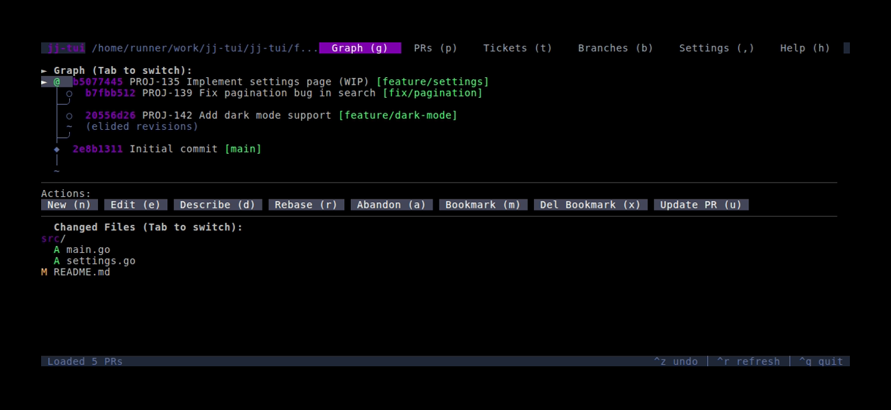
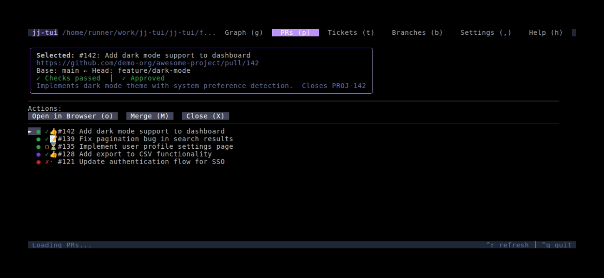
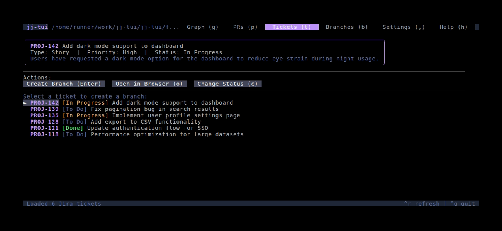
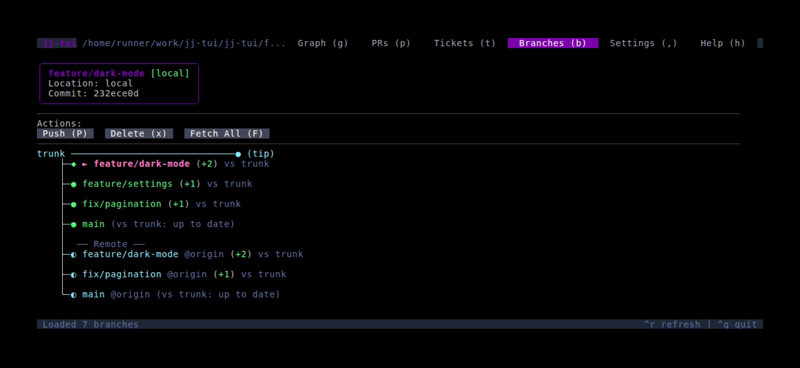
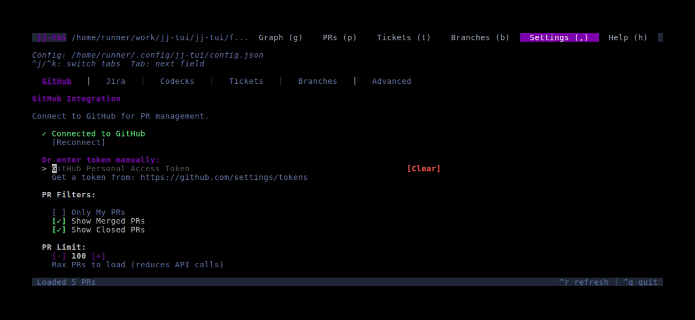
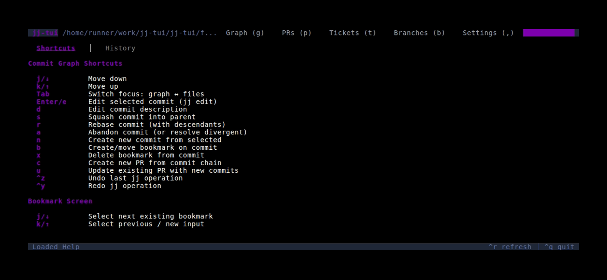

# Jujutsu TUI

A modern Terminal User Interface (TUI) for managing [Jujutsu](https://github.com/martinvonz/jj) repositories. Built with [Bubble Tea](https://github.com/charmbracelet/bubbletea) and [Lip Gloss](https://github.com/charmbracelet/lipgloss) for an intuitive and beautiful command-line experience.

### Graph


### Pull Requests


### Tickets


### Branches


### Settings


### Help


## Features

- **Visual Commit Graph**: Navigate and visualize your commit history with tree structure
- **Split-Pane View**: Graph and changed files in separate scrollable panes with click-to-focus
- **Changed Files View**: See files modified in the selected commit with a nested folder structure
- **Keyboard & Mouse Support**: Full keyboard navigation with zone-based mouse support for clickable UI elements
- **GitHub Integration**: Create and manage GitHub Pull Requests directly from the TUI
- **GitHub Device Flow**: Login to GitHub via browser - no token copying required
- **Ticket Integration**: View assigned tickets from Jira, Codecks, or GitHub Issues and create branches with auto-populated names
- **Ticket Status Transitions**: Change ticket statuses directly from the TUI (In Progress, Done, etc.)
- **Commit Management**: Edit, squash, describe, abandon, rebase, and manage commits with simple key presses
- **New Commits from Immutable Parents**: Create new commits based on `main` or other immutable commits
- **Bookmark Management**: Create, move, and delete bookmarks on commits
- **Immutable Commit Detection**: Automatically detects and protects immutable commits (pushed to remote)
- **Divergent Commit Resolution**: Detect and resolve divergent commits (same change ID in multiple versions)
- **Conflicted Bookmark Resolution**: Resolve bookmark conflicts when local and remote have diverged
- **Repository Cleanup Tools**: Abandon old commits, delete all bookmarks, track remote branches
- **Auto-Initialize**: Prompt to run `jj git init` when opening a non-jj repository
- **Real-time Updates**: Auto-refresh repository state and see changes immediately
- **Modern UI**: Beautiful styling with colors, borders, and responsive layouts

## Prerequisites

- [Jujutsu (jj)](https://github.com/martinvonz/jj) installed and available in your PATH
- A jujutsu repository to work with

## Installation

### Homebrew (macOS/Linux)

```bash
brew install madicen/tap/jj-tui
```

### Go Install

If you have Go 1.24+ installed:

```bash
go install github.com/madicen/jj-tui@latest
```

### Download Binary (Linux/macOS)

Download and install the latest release with one command:

**Linux (amd64):**
```bash
curl -sL $(curl -s https://api.github.com/repos/madicen/jj-tui/releases/latest | grep browser_download_url | grep linux_amd64 | cut -d '"' -f 4) | tar xz && sudo mv jj-tui /usr/local/bin/
```

**Linux (arm64):**
```bash
curl -sL $(curl -s https://api.github.com/repos/madicen/jj-tui/releases/latest | grep browser_download_url | grep linux_arm64 | cut -d '"' -f 4) | tar xz && sudo mv jj-tui /usr/local/bin/
```

**macOS (Apple Silicon):**
```bash
curl -sL $(curl -s https://api.github.com/repos/madicen/jj-tui/releases/latest | grep browser_download_url | grep darwin_arm64 | cut -d '"' -f 4) | tar xz && sudo mv jj-tui /usr/local/bin/
```

**macOS (Intel):**
```bash
curl -sL $(curl -s https://api.github.com/repos/madicen/jj-tui/releases/latest | grep browser_download_url | grep darwin_amd64 | cut -d '"' -f 4) | tar xz && sudo mv jj-tui /usr/local/bin/
```

Or download manually from the [GitHub Releases](https://github.com/madicen/jj-tui/releases) page.

Available for:
- **macOS** (Intel & Apple Silicon)
- **Linux** (amd64 & arm64)
- **Windows** (amd64 & arm64)

### From Source

Requires Go 1.24+:

```bash
git clone https://github.com/madicen/jj-tui.git
cd jj-tui
go build -o jj-tui .
```

### Running

```bash
# From within a jujutsu repository
jj-tui

# Or specify a repository path
jj-tui /path/to/your/jj/repo
```

## Usage

### Global Shortcuts

- `Ctrl+q`: Quit application
- `Ctrl+r`: Refresh current view
- `Ctrl+z`: Undo last jj operation
- `Ctrl+y`: Redo (undo the undo)
- `g`: Switch to commit graph view
- `p`: Switch to pull requests view
- `t`: Switch to tickets (Jira) view
- `,`: Open settings
- `h`: Show help
- `Esc`: Return to main view / Cancel current action

### Commit Graph View

The graph view has two panes: the commit graph (left) and changed files (right). Click on either pane to focus it, or use keyboard navigation.

**Navigation:**
- `↑/↓`, `j/k`: Navigate commits (graph pane) or scroll (files pane)
- `Tab`: Switch focus between graph and files panes
- **Click** on a pane to focus it
- **Mouse scroll** works on the focused pane

**Commit Actions:**
- `e`, `Enter`: Edit selected commit (checkout with `jj edit`)
- `s`: Squash selected commit into parent
- `n`: Create new commit (works even on immutable commits like `main`)
- `d`: Edit commit description
- `a`: Abandon commit
- `r`: Rebase selected commit
- `b`: Create or move bookmark on selected commit
- `x`: Delete bookmark from selected commit
- `c`: Create PR from selected commit (if bookmark exists)
- `u`: Push/update PR (pushes to existing PR branch)

### Pull Requests View

- `↑/↓`, `j/k`: Navigate pull requests
- `Enter`, `e`: Open PR in browser
- `Ctrl+r`: Refresh PR list

### Tickets View (Jira / Codecks / GitHub Issues)

- `↑/↓`, `j/k`: Navigate tickets
- `Enter`: Create branch from selected ticket
- `o`: Open ticket in browser
- `c`: Change ticket status (transitions to In Progress, Done, etc.)
- `Ctrl+r`: Refresh ticket list

### Settings View

- `Ctrl+J`: Previous sub-tab (GitHub, Jira, Codecks, Advanced)
- `Ctrl+K`: Next sub-tab
- `Tab`, `↓`: Move to next field
- `Shift+Tab`, `↑`: Move to previous field
- `Enter`: Move to next field (or save if on last field)
- `Ctrl+S`: Save settings globally
- `Ctrl+L`: Save settings to local `.jj-tui.json`
- `Esc`: Cancel and return to graph
- **Click** on any field or tab to focus/select it

### Advanced Settings

The Advanced tab in Settings provides repository cleanup tools:

- **Delete All Bookmarks**: Remove all bookmarks in the repository
- **Abandon Old Commits**: Abandon all mutable commits (useful for cleaning up after merging PRs)
- **Track origin/main**: Fetch and track the remote main branch

## Settings

You can configure your API credentials in two ways:

### Option 1: In-App Settings (Recommended)

1. Press `,` or click the **Settings** tab
2. Enter your credentials in the form fields
3. Press `Ctrl+S` or click **Save** to apply

Settings are saved to `~/.config/jj-tui/config.json` and persist across sessions.

### Option 2: Environment Variables

## GitHub Integration

There are two ways to authenticate with GitHub:

### Option 1: Browser Login (Recommended)

1. Press `,` to open Settings
2. Click **Login with GitHub**
3. Your browser will open to GitHub's authorization page
4. Enter the code shown in the TUI
5. Authorize the application

Your token is automatically saved and persists across sessions.

### Option 2: Personal Access Token

Set your GitHub token as an environment variable:

```bash
export GITHUB_TOKEN=your_github_personal_access_token
```

Or enter it manually in Settings.

The application will automatically detect GitHub remotes and enable PR functionality.

### PR Workflow

1. Select a commit with a bookmark in the graph view
2. Press `c` to create a PR, or `u` to update an existing PR
3. Fill in the PR title and description
4. Press `Ctrl+S` to submit

**Note:** You can create/update PRs from descendant commits - the bookmark will automatically be moved to the selected commit.

## Jira Integration

To use Jira features, set your Jira credentials:

```bash
export JIRA_URL=https://your-domain.atlassian.net
export JIRA_USER=your-email@example.com
export JIRA_TOKEN=your_api_token
```

Get your API token from: https://id.atlassian.com/manage-profile/security/api-tokens

### Jira Workflow

1. Press `t` to open the Tickets view
2. Navigate through your assigned tickets with `j/k` or arrow keys
3. Press `Enter` to create a branch from the selected ticket
   - Creates a new commit branched from main
   - Creates a bookmark with a sanitized name (e.g., `PROJ-123-ticket-summary`)
   - Rebases your current work onto the new branch
   - Pre-populates PR title with "PROJ-123 - Ticket Summary" when you create a PR

## GitHub Issues Integration

If you're using GitHub Issues for task tracking, they work automatically with your GitHub authentication:

1. Login to GitHub (via browser or token)
2. Select "GitHub Issues" as your ticket provider in Settings
3. Issues assigned to you will appear in the Tickets tab

### GitHub Issues Workflow

1. Press `t` to open the Tickets view
2. Navigate through your assigned issues with `j/k` or arrow keys
3. Press `Enter` to create a branch from the selected issue
   - Creates a new commit branched from main
   - Creates a bookmark with a sanitized name (e.g., `123-issue-summary`)
   - Pre-populates PR title with "#123 - Issue Summary" when you create a PR
4. Press `c` to change issue status (Open ↔ Closed)
5. Press `o` to open the issue in your browser

## Codecks Integration

[Codecks](https://www.codecks.io/) is a project management tool designed for game developers. To use Codecks features, set your credentials:

```bash
export CODECKS_SUBDOMAIN=your-account-name
export CODECKS_TOKEN=your_auth_token
export CODECKS_PROJECT=Optional-Project-Name  # Optional: filter cards by project
```

### Getting Your Codecks Token

1. Log in to Codecks in your browser
2. Open browser Developer Tools (F12)
3. Go to Application → Cookies → `https://your-account.codecks.io`
4. Copy the value of the `at` cookie - this is your auth token

### Codecks Workflow

1. Press `t` to open the Tickets view
2. Navigate through your assigned cards with `j/k` or arrow keys
3. Press `o` to open the card in your browser
4. Press `Enter` to create a branch from the selected card
   - Creates a new commit branched from main
   - Creates a bookmark with the short ID (e.g., `12u-add-feature-name`)
   - Automatically prepopulates commit descriptions with the card's short ID (e.g., `$12u`)
   - Pre-populates PR title with "$12u - Card Title" when you create a PR

### Codecks Features

- **Short IDs**: Cards display their Codecks short ID (e.g., `$12u`) for easy reference
- **Project Filtering**: Optionally filter cards to a specific project
- **Archive Filtering**: Archived and deleted cards are automatically hidden
- **Direct Links**: Open cards directly in Codecks from the TUI

## Configuration

The application automatically detects:
- Current jujutsu repository
- GitHub remote configuration
- User preferences from jj config
- Credentials from environment variables or in-app settings

### Config File Locations

jj-tui supports multiple configuration files with the following priority (highest to lowest):

1. **`JJ_TUI_CONFIG` environment variable** - Custom config file path
2. **`.jj-tui.json`** - Per-repo config in current directory
3. **`~/.config/jj-tui/config.json`** - Global config

Local config values **merge with and override** global config values. This allows you to:
- Keep sensitive tokens (GitHub, Jira, Codecks) in the global config
- Override project-specific settings (like `codecks_project`) per-repo

### Per-Repo Configuration

Create a `.jj-tui.json` in your repository root to customize settings for that repo:

```json
{
  "ticket_provider": "codecks",
  "codecks_project": "My Project Name"
}
```

You can also share configs across similar repos using the environment variable:

```bash
export JJ_TUI_CONFIG=/path/to/shared-config.json
jj-tui
```

### Config File Format

```json
{
  "github_token": "ghp_...",
  "ticket_provider": "github_issues",
  "jira_url": "https://company.atlassian.net",
  "jira_user": "user@example.com",
  "jira_token": "...",
  "jira_excluded_statuses": "Done,Closed",
  "codecks_subdomain": "myteam",
  "codecks_token": "...",
  "codecks_project": "Project Name",
  "codecks_excluded_statuses": "done,resolved",
  "github_issues_excluded_statuses": "closed"
}
```

### Ticket Provider Options

The `ticket_provider` field can be one of:
- `"jira"` - Use Jira for tickets
- `"codecks"` - Use Codecks for tickets  
- `"github_issues"` - Use GitHub Issues for tickets
- `""` (empty) - Auto-detect based on configured credentials

## Development

### Project Structure

```
jj-tui/
├── main.go                 # Application entry point
├── internal/
│   ├── jj/                 # Jujutsu command integration
│   │   └── service.go
│   ├── github/             # GitHub API integration
│   │   ├── service.go      # GitHub PR service
│   │   └── issues_service.go # GitHub Issues ticket provider
│   ├── jira/               # Jira API integration
│   │   └── service.go
│   ├── codecks/            # Codecks API integration
│   │   └── service.go
│   ├── tickets/            # Generic ticket service interface
│   │   └── interface.go
│   ├── mock/               # Mock services for demo mode
│   │   ├── tickets.go
│   │   └── github.go
│   ├── config/             # Configuration management
│   │   └── config.go
│   ├── models/             # Data models
│   │   └── commit.go
│   └── tui/                # Terminal UI components
│       ├── tui.go          # Public facade (re-exports from model/)
│       ├── model/          # Core TUI model
│       │   ├── model.go    # Main application model
│       │   ├── view.go     # View rendering
│       │   ├── keys.go     # Keyboard handlers
│       │   ├── mouse.go    # Mouse handlers
│       │   ├── actions.go  # Business logic actions
│       │   ├── commands.go # Async commands
│       │   ├── cleanup.go  # Repository cleanup actions
│       │   ├── messages.go # Event message types
│       │   ├── zones.go    # Clickable zone ID constants
│       │   └── styles.go   # UI styling
│       ├── actions/        # Action handlers
│       │   └── *.go
│       └── view/           # View renderers
│           ├── renderer.go
│           ├── graph.go
│           ├── prs.go
│           ├── jira.go
│           ├── settings.go
│           ├── bookmark.go
│           └── help.go
├── integration_tests/      # Integration tests
│   └── main_test.go
├── fixtures/               # Demo repository for screenshots
│   └── setup-demo-repo.sh
├── vhs/                    # VHS tapes for screenshot generation
│   └── *.tape
├── screenshots/            # Generated screenshots (used in README)
├── Makefile
└── README.md
```

### Building

```bash
go mod tidy
go build -o jj-tui .
```

### Updating Screenshots

Screenshots are generated using [VHS](https://github.com/charmbracelet/vhs) with mock data for consistent, reproducible images.

```bash
# Generate all screenshots
make screenshots

# Or run individual tapes
vhs vhs/graph.tape
```

This creates a demo jj repository and runs the app in `--demo` mode, which uses mock ticket and PR data.

**Demo Mode**: You can also run the app manually in demo mode for testing:

```bash
make demo
# Or: ./jj-tui --demo
```

### Testing

Run all tests:

```bash
go test ./... -v
```

Run TUI unit tests:

```bash
go test ./internal/tui/ -v
```

Run integration tests (requires `jj` installed):

```bash
go test ./integration_tests/ -v
```

### Dependencies

- **[Bubble Tea](https://github.com/charmbracelet/bubbletea)**: Terminal UI framework
- **[Lip Gloss](https://github.com/charmbracelet/lipgloss)**: Styling and layout
- **[Bubblezone](https://github.com/lrstanley/bubblezone)**: Mouse zone management for clickable UI elements
- **[go-github](https://github.com/google/go-github)**: GitHub API client
- **[oauth2](https://golang.org/x/oauth2)**: OAuth2 authentication

## User Stories

The application supports these key user workflows:

### 1. Commit Navigation
- View commit history in a visual graph with split-pane layout
- Navigate with keyboard shortcuts or mouse
- See commit details, authors, and timestamps
- View changed files for each commit in a separate scrollable pane
- Click to switch focus between graph and files panes

### 2. Commit Management
- Edit commits (checkout with `jj edit`)
- Squash commits into their parents
- Rebase commits onto different parents
- Create new commits (including from immutable parents like `main`)
- Immutable commit protection (cannot modify pushed commits)

### 3. Bookmark Management
- Create bookmarks on any mutable commit
- Move existing bookmarks to different commits
- Delete bookmarks when no longer needed

### 4. Pull Request Workflow
- Create GitHub PRs from commits with bookmarks
- View existing PRs with status and descriptions
- Update PRs by pushing new commits
- Push from descendant commits (bookmark auto-moves)
- Login to GitHub via browser (Device Flow) - no token copying needed

### 5. Ticket Integration (Jira, Codecks & GitHub Issues)
- View assigned tickets from Jira, Codecks cards, or GitHub Issues
- Create branches from tickets with auto-named bookmarks
- PR titles auto-populated from ticket info
- Commit descriptions pre-populated with ticket IDs (Codecks)
- Change ticket status directly from the TUI (In Progress, Done, etc.)
- Open tickets directly in browser
- Consistent layout with description placeholders

### 6. Repository Monitoring
- Real-time repository state updates
- Conflict detection and display
- Divergent commit detection with visual indicator (⑂)
- Bookmark visualization
- Working copy indicator

### 7. Conflict Resolution
- Resolve divergent commits (choose which version to keep)
- Resolve conflicted bookmarks (keep local or reset to remote)
- Visual indicators in Graph and Branches views

### 8. Repository Setup & Cleanup
- Auto-detect non-jj repositories and offer to initialize
- Initialize with `jj git init` and automatically track `main@origin`
- Abandon old commits after merging PRs
- Delete all bookmarks for fresh start
- Track/fetch remote branches

## Contributing

1. Fork the repository
2. Create a feature branch
3. Add tests for new functionality
4. Run integration tests
5. Submit a pull request

## License

MIT License - see LICENSE file for details.

## Acknowledgments

- [Jujutsu](https://github.com/martinvonz/jj) for the amazing VCS
- [Charm](https://charm.sh/) for the excellent TUI libraries
- The Go community for great tooling and libraries
