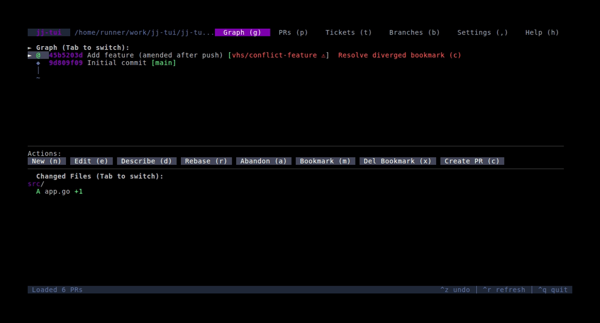

# Jujutsu TUI


A modern Terminal User Interface (TUI) for managing [Jujutsu (jj)](https://github.com/jj-vcs/jj) repositories. Built with [Bubble Tea](https://github.com/charmbracelet/bubbletea) and [Lip Gloss](https://github.com/charmbracelet/lipgloss) for an intuitive and beautiful command-line experience.

The demo above walks through the **commit graph**, **tickets**, **pull requests**, and **branches** (`make demo-gif` / `vhs/all.tape`). Static captures below cover views that are not in that recording.

### Settings


### Help


### Command History


### Forgot new commit? and Update PR

If you already pushed a feature bookmark but kept editing on the same jj revision (so your tree diverges from `bookmark@origin`), **Forgot new commit?** (`f`) restacks that work on the remote tip so you can push without `--force`. **Update PR** (`u`) pushes the bookmark and updates the open PR. The clip below walks through opening a PR, editing without a new commit, then `f` and `u`.


### Split

**Split** (`z`) opens an **jj evolog** picker for the selected change: pick an older evolution revision as the parent, preview which files differ from the tip, then run the FAQ-style flow (`jj new`, `jj restore`, optional bookmark move, `jj abandon` old tip). Optional AI-assisted **file** split uses non-interactive `jj split -r @ -- <paths>`; use a recent **jj** (0.14+) so path arguments to `jj split` behave as expected. The recording below uses a small fixture repo (`fixtures/setup-evolog-split-vhs-repo.sh`) so the modal shows a clear two-file rollout delta.


### Resolving divergent commits

When the same **change ID** exists on more than one revision, the graph shows **divergent**. Press **`d`** on that row to open the resolver: each option lists metadata and a short **files vs parent** summary so you can pick which revision to keep (the others are abandoned). The clip uses `fixtures/setup-divergent-vhs-repo.sh`.


### Resolving diverged bookmarks (local vs remote)

When a bookmark was pushed and then amended or moved locally, **jj** may show the branch as diverged from `bookmark@origin`. **Branches** (`b`): move the highlight to the **diverged local** bookmark (`j`/`k`), then **Resolve Conflict** (`c`)—a **centered popup** compares local vs `origin` and offers **Keep local** (resolve the bookmark, then `jj git push`) or **Reset to origin**. The list is **sorted** (locals with commits ahead of `trunk` and none behind are listed before e.g. `main`), so in the bookmark-conflict fixture the diverged feature is often **already first**—an extra **Down** would select `main` and **`c`** would not open the resolver. On the **graph**, with the row selected and the graph pane focused, **`c`** opens the same resolver when that row has a diverged bookmark (otherwise **`c`** starts **Create PR**). **`C` (shift+c)** also opens the resolver on a diverged row. Narrow terminals stack the columns; wide terminals show local/remote and both choices **side by side** so the dialog stays short for mice. Recording: `fixtures/setup-bookmark-conflict-vhs-repo.sh`, `make bookmark-conflict-gif`.



## Features

- **Visual commit graph**: Navigate history with ASCII graph, symbols for working copy / mutable / immutable, divergent and conflict indicators
- **Split-pane layout**: Graph and changed files in separate scrollable panes; **Tab** or **click** to focus; mouse wheel scrolls the focused pane
- **Changed files**: Per-commit file list with line stats; **move** a file to a new parent/child commit (`[` / `]`) or **revert** it (`v`) from the files pane
- **File diff overlay**: **`o`** (files pane) opens a full **jj** diff for the selected path in a scrollable modal
- **External editor**: **`O`** (files pane) opens the selected file in Cursor, VS Code, Zed, Neovim (`nvr`), etc.—configured under **Settings → Advanced**
- **Rebase**: **`r`** enters destination-pick mode, or **drag** a commit row onto another (mouse) for the same `jj rebase -s … -d …` flow
- **Keyboard & mouse**: Zone-based clicks across tabs, settings, PRs, tickets, and branch lists
- **GitHub**: Create/update PRs, device-flow login, PR list with CI and review hints
- **Tickets**: Jira, Codecks, or GitHub Issues—provider choice in Settings; create a bookmark from a ticket on your current commit; status transitions where supported
- **Branches**: List locals/remotes, track/untrack, push/fetch, resolve diverged bookmarks
- **Settings**: GitHub, Jira, Codecks, **Tickets** (provider + workflow), **Branches** (limit), **Theme** (primary/secondary/muted), **Advanced** (editor, graph revset, bookmark sanitize, destructive cleanup)
- **Help tab**: Shortcuts reference plus **command history** of **jj** commands the TUI ran (copy-friendly)
- **Evolog split (`z`)**: Experimental FAQ-style split when evolution history allows (see [Split](#split))
- **Divergent commits & diverged bookmarks**: Dedicated flows from the graph or Branches tab (see sections below)
- **Undo / redo**: **`Ctrl+z`** / **`Ctrl+y`** for **jj** undo and redo
- **Non-repo & init**: Prompt to **`jj git init`** when the path is not a jj repo
- **Demo mode**: **`jj-tui --demo`** uses mock tickets/PRs for screenshots or trying the UI
- **Config**: Global and per-repo **`.jj-tui.json`** merge; optional **`JJ_TUI_CONFIG`**

## Prerequisites

- [Jujutsu (jj)](https://jj-vcs.github.io/jj/) installed and on your `PATH`
- A jj repository to work with (or use **`jj-tui --demo`**)

## Installation

### Homebrew (macOS/Linux)

```bash
brew install --cask madicen/tap/jj-tui
```

### Go Install

If you have Go 1.24+ installed:

```bash
go install github.com/madicen/jj-tui@latest
```

### Download Binary (Linux/macOS)

Download and install the latest release with one command:

**Linux (amd64):**
```bash
curl -sL $(curl -s https://api.github.com/repos/madicen/jj-tui/releases/latest | grep browser_download_url | grep linux_amd64 | cut -d '"' -f 4) | tar xz && sudo mv jj-tui /usr/local/bin/
```

**Linux (arm64):**
```bash
curl -sL $(curl -s https://api.github.com/repos/madicen/jj-tui/releases/latest | grep browser_download_url | grep linux_arm64 | cut -d '"' -f 4) | tar xz && sudo mv jj-tui /usr/local/bin/
```

**macOS (Apple Silicon):**
```bash
curl -sL $(curl -s https://api.github.com/repos/madicen/jj-tui/releases/latest | grep browser_download_url | grep darwin_arm64 | cut -d '"' -f 4) | tar xz && sudo mv jj-tui /usr/local/bin/
```

**macOS (Intel):**
```bash
curl -sL $(curl -s https://api.github.com/repos/madicen/jj-tui/releases/latest | grep browser_download_url | grep darwin_amd64 | cut -d '"' -f 4) | tar xz && sudo mv jj-tui /usr/local/bin/
```

Or download manually from the [GitHub Releases](https://github.com/madicen/jj-tui/releases) page.

Available for:
- **macOS** (Intel & Apple Silicon)
- **Linux** (amd64 & arm64)
- **Windows** (amd64 & arm64)

### From Source

Requires Go 1.24+:

```bash
git clone https://github.com/madicen/jj-tui.git
cd jj-tui
go build -o jj-tui .
```

### Running

```bash
# From within a jujutsu repository
jj-tui

# Or specify a repository path
jj-tui /path/to/your/jj/repo

# Demo mode: use a demo repo with mock tickets/PRs (e.g. for screenshots or trying the UI)
cd path/to/jj/repo
jj-tui --demo
```

## Usage

### Global Shortcuts

- `Ctrl+q`: Quit application
- `Ctrl+r`: Refresh current view
- `Ctrl+z`: Undo last jj operation
- `Ctrl+y`: Redo (undo the undo)
- `g`: Switch to commit graph view
- `p`: Switch to pull requests view
- `t`: Switch to tickets view
- `b`: Switch to branches view
- `,`: Open settings
- `h`, `?`: Show help
- `Esc`: Return to graph / Cancel current action

### Commit graph

The graph view has two panes: the commit graph (left) and changed files (right). Click on either pane to focus it, or use keyboard navigation.

**Navigation:**
- `↑/↓`, `j/k`: Navigate commits (graph pane) or scroll (files pane)
- `Tab`: Switch focus between graph and files panes
- **Click** on a pane to focus it
- **Mouse scroll** works on the focused pane

**Commit actions (graph pane focused unless noted):**
- `e`, `Enter`: Edit selected commit (`jj edit`)
- `n`: Create new commit (works from immutable parents like `main`)
- `d`: Edit description; on a **divergent** row, opens the divergent resolver instead
- `s`: Squash into parent (hidden when the parent would be immutable)
- `r`: Rebase mode—pick destination with `Enter`/`e`, or **Esc** to cancel
- **Mouse**: Press on a commit row, drag, release on another commit to rebase (same as `r` + pick destination); **Esc** cancels an in-progress drag
- `a`: Abandon commit
- `m`: Create or move bookmark
- `x`: Delete bookmark
- `c`: Create PR, or **resolve diverged bookmark** when the row has a conflicted/diverged bookmark (`c` matches Branches-tab behavior)
- `C` (shift+c): **Resolve diverged bookmark** when shown on the row
- `u`: Update PR (push bookmark branch)
- `f`: **Forgot New Commit?** (when the inline control appears)—restack after amending a pushed bookmark so you can push without `--force`
- `z`: **Split (evolog)** when the inline **split (z)** appears—see [Split](#split)

**Files pane (focus with Tab or click the files side):**
- `o`: Open full **jj** diff for the selected file (modal)
- `O`: Open the selected file in the **external editor** (configure under **Settings → Advanced**)
- `[` / `]`: Move file to new parent / child commit
- `v`: Revert the file in this commit

### Help tab (`h` / `?`)

- **`Ctrl+j`** / **`Ctrl+k`** (or **`Tab`**): Switch between **Shortcuts** and **Command history**
- **Command history** lists **`jj`** commands the TUI ran (with timing); copy-friendly for debugging or docs
- Mouse **wheel** scrolls the active sub-tab

### Pull Requests view

- `↑/↓`, `j/k`: Navigate pull requests
- `Enter`, `e`: Open PR in browser
- `Ctrl+r`: Refresh PR list

### Tickets view (Jira / Codecks / GitHub Issues)

- `↑/↓`, `j/k`: Navigate tickets
- `Enter`: Create branch from selected ticket (creates a bookmark on your **current commit** with the ticket name)
- `o`: Open ticket in browser
- `c`: Change ticket status (transitions to In Progress, Done, etc.)
- `Ctrl+r`: Refresh ticket list

### Settings view

Sub-tabs (use **`Ctrl+j`** / **`Ctrl+k`**, click the tab bar, or **`Tab`** through fields):

1. **GitHub** — token / device login, PR list filters, refresh interval  
2. **Jira** — URL, user, token, projects, JQL, filters  
3. **Codecks** — subdomain, token, project filter  
4. **Tickets** — active provider (None / Jira / Codecks / GitHub Issues), auto “In Progress” on branch-from-ticket, GitHub Issues status excludes  
5. **Branches** — how many branches to load for the Branches tab (`0` = all)  
6. **Theme** — primary, secondary, muted accent colors (click swatches or **Save** to persist)  
7. **Advanced** — see below  

**Keys:**

- **`Ctrl+j`** / **`Ctrl+k`**: Previous / next settings sub-tab  
- **`Tab`** / **`Shift+Tab`**: Next / previous field (and tab bar navigation where applicable)  
- **`Ctrl+s`**: Save globally (`~/.config/jj-tui/config.json`)  
- **`Ctrl+l`**: Save **local** (`.jj-tui.json` in the repo)  
- **`Esc`**: Cancel and return to the graph (or dismiss in-tab overlays first)  
- **Click** fields, tabs, toggles, and theme swatches

### Advanced settings

- **Open in external editor**: Presets (Cursor, VS Code, Zed, Neovim/`nvr`, Emacs, Sublime, JetBrains) or **Custom** (`sh -c` with `{path}` → absolute file path). Used from the graph **files** pane with **`O`**.  
- **Default graph revset**: Optional `jj` revset for the commit list; empty = built-in default (see [Graph view revset](#graph-view-revset)).  
- **Sanitize bookmark names**: Auto-fix invalid bookmark characters when creating/moving names.  
- **Delete all bookmarks** / **Abandon old commits**: Destructive maintenance (with confirmation).

## Settings

You can configure your API credentials in two ways:

### Option 1: In-App Settings (Recommended)

1. Press `,` or click the **Settings** tab
2. Enter your credentials in the form fields
3. Press `Ctrl+S` or click **Save** to apply

Settings are saved to `~/.config/jj-tui/config.json` and persist across sessions.

### Option 2: Environment Variables

You can also set credentials via environment variables; see the GitHub, Jira, and Codecks sections below for the relevant variable names. Environment variables are applied when the app starts and can be overridden by in-app settings.

## GitHub Integration

There are two ways to authenticate with GitHub:

### Option 1: Browser Login (Recommended)

1. Press `,` to open Settings
2. Click **Login with GitHub**
3. Your browser will open to GitHub's authorization page
4. Enter the code shown in the TUI
5. Authorize the application

Your token is automatically saved and persists across sessions.

### Option 2: Personal Access Token

Set your GitHub token as an environment variable:

```bash
export GITHUB_TOKEN=your_github_personal_access_token
```

Or enter it manually in Settings.

The application will automatically detect GitHub remotes and enable PR functionality.

### PR Workflow

1. Select a commit with a bookmark in the graph view
2. Press `c` to create a PR, or `u` to update an existing PR
3. Fill in the PR title and description
4. Press `Ctrl+S` to submit

**Note:** You can create/update PRs from descendant commits - the bookmark will automatically be moved to the selected commit.

## Jira Integration

To use Jira features, set your Jira credentials:

```bash
export JIRA_URL=https://your-domain.atlassian.net
export JIRA_USER=your-email@example.com
export JIRA_TOKEN=your_api_token
```

Get your API token from: https://id.atlassian.com/manage-profile/security/api-tokens

### Jira Workflow

1. Press `t` to open the Tickets view
2. Navigate through your assigned tickets with `j/k` or arrow keys
3. Press `Enter` to create a branch from the selected ticket
   - Creates a **bookmark on your current commit** with a sanitized name (e.g., `PROJ-123-ticket-summary`)
   - Keeps your existing work and commit description intact
   - Optional: if "In Progress on branch" is enabled in settings, transitions the ticket to In Progress
   - When you create a PR, the title is pre-populated with "PROJ-123 - Ticket Summary"

## GitHub Issues Integration

If you're using GitHub Issues for task tracking, they work automatically with your GitHub authentication:

1. Login to GitHub (via browser or token)
2. Select "GitHub Issues" as your ticket provider in Settings
3. Issues assigned to you will appear in the Tickets tab

### GitHub Issues Workflow

1. Press `t` to open the Tickets view
2. Navigate through your assigned issues with `j/k` or arrow keys
3. Press `Enter` to create a branch from the selected issue
   - Creates a **bookmark on your current commit** with a sanitized name (e.g., `123-issue-summary`)
   - When you create a PR, the title is pre-populated with "#123 - Issue Summary"
4. Press `c` to change issue status (Open ↔ Closed)
5. Press `o` to open the issue in your browser

## Codecks Integration

[Codecks](https://www.codecks.io/) is a project management tool designed for game developers. To use Codecks features, set your credentials:

```bash
export CODECKS_SUBDOMAIN=your-account-name
export CODECKS_TOKEN=your_auth_token
export CODECKS_PROJECT=Optional-Project-Name  # Optional: filter cards by project
```

### Getting Your Codecks Token

1. Log in to Codecks in your browser
2. Open browser Developer Tools (F12)
3. Go to Application → Cookies → `https://your-account.codecks.io`
4. Copy the value of the `at` cookie - this is your auth token

### Codecks Workflow

1. Press `t` to open the Tickets view
2. Navigate through your assigned cards with `j/k` or arrow keys
3. Press `o` to open the card in your browser
4. Press `Enter` to create a branch from the selected card
   - Creates a **bookmark on your current commit** with the card title (or short ID) as the name
   - Automatically prepopulates commit descriptions with the card's short ID (e.g., `$12u`) when editing
   - When you create a PR, the title is pre-populated with "$12u - Card Title"

### Codecks Features

- **Short IDs**: Cards display their Codecks short ID (e.g., `$12u`) for easy reference
- **Project Filtering**: Optionally filter cards to a specific project
- **Archive Filtering**: Archived and deleted cards are automatically hidden
- **Direct Links**: Open cards directly in Codecks from the TUI

## Configuration

The application automatically detects:
- Current jujutsu repository
- GitHub remote configuration
- User preferences from jj config
- Credentials from environment variables or in-app settings

### Config File Locations

jj-tui supports multiple configuration files with the following priority (highest to lowest):

1. **`JJ_TUI_CONFIG` environment variable** - Custom config file path
2. **`.jj-tui.json`** - Per-repo config in current directory
3. **`~/.config/jj-tui/config.json`** - Global config

Local config values **merge with and override** global config values. This allows you to:
- Keep sensitive tokens (GitHub, Jira, Codecks) in the global config
- Override project-specific settings (like `codecks_project`) per-repo

### Per-Repo Configuration

Create a `.jj-tui.json` in your repository root to customize settings for that repo:

```json
{
  "ticket_provider": "codecks",
  "codecks_project": "My Project Name"
}
```

You can also share configs across similar repos using the environment variable:

```bash
export JJ_TUI_CONFIG=/path/to/shared-config.json
jj-tui
```

### Config file format

```json
{
  "github_token": "ghp_...",
  "ticket_provider": "github_issues",
  "ticket_auto_in_progress": true,
  "jira_url": "https://company.atlassian.net",
  "jira_user": "user@example.com",
  "jira_token": "...",
  "jira_excluded_statuses": "Done,Closed",
  "codecks_subdomain": "myteam",
  "codecks_token": "...",
  "codecks_project": "Project Name",
  "codecks_excluded_statuses": "done,resolved",
  "github_issues_excluded_statuses": "closed",
  "branch_limit": 50,
  "sanitize_bookmark_names": true,
  "graph_revset": "",
  "external_file_editor": "cursor",
  "external_file_editor_custom": "cursor -g {path}",
  "theme_primary": "#7E00AF",
  "theme_secondary": "#FF79C6",
  "theme_muted": "#6272A4",
  "ai_enabled": false,
  "ai_provider": "openai_compatible",
  "ai_api_key": "",
  "ai_base_url": "https://api.openai.com/v1",
  "ai_model": "gpt-4o-mini",
  "ai_timeout_seconds": 60
}
```

Omit keys you do not need. See `internal/config/config.go` for the full schema and merge rules.

### Optional AI assist

When **`ai_enabled`** is true and LLM credentials are available, jj-tui can call a provider to draft text:

- The purple **✧ ^g** chip beside the title in the commit description editor, **Create PR**, **Create ticket**, or **bookmark** modal (new name only), or **Ctrl+G** in those modals, runs generation; you always review before saving or submitting.
- **`ai_provider`**:
  - **`openai_compatible`** (default): Chat Completions at **`ai_base_url`** (default `https://api.openai.com/v1`). Requires an API key unless **`ai_base_url`** is a typical local Ollama URL (`http://127.0.0.1:11434/v1` or `http://localhost:11434/v1`), in which case a placeholder Bearer token is sent automatically.
  - **`gemini`**: Google Generative Language API (requires a real API key).
  - **`ollama`**: Local Ollama OpenAI-compatible API. Defaults: **`ai_base_url`** empty → `http://127.0.0.1:11434/v1`, **`ai_model`** empty → `qwen2.5:1.5b`. **API key is optional** (jj-tui sends a harmless placeholder if unset). Pull the model first (`ollama pull qwen2.5:1.5b` or change **`ai_model`** to a tag you have).
- **`ai_api_key`** / **`JJ_TUI_AI_API_KEY`**: For cloud OpenAI-compatible hosts and Gemini, set a real key (env wins). For **`ollama`** or the local Ollama **`ai_base_url`** above, you may leave the key empty.
- **`ai_base_url`**: API root without a trailing slash. Ignored for Gemini (Google endpoint).
- **`ai_model`**: Model id. Defaults: `gpt-4o-mini` (OpenAI-compatible), `gemini-2.5-flash` (Gemini), or `qwen2.5:1.5b` (**`ollama`**) when empty.
- **`ai_timeout_seconds`**: HTTP timeout (optional; default 60). Local models may need more on **first request after idle** (model load); try **120** or higher if requests time out.

Configure from **Settings → Advanced** or JSON. Diffs are included in prompts; treat this as sending code to the provider unless you use a local endpoint.

**Cursor / in-IDE models:** Cursor’s chat models are not exposed as a stable HTTP API for third-party apps to call from the TUI. Practical options are **your own API keys** (OpenAI, Google AI Studio for Gemini, Anthropic via an OpenAI-compatible gateway, local Ollama, etc.).

### Graph view revset

The commit graph shows commits selected by a **jj revset**. By default (empty `graph_revset`) jj-tui uses a built-in revset (see below) that: limits **mutable** rows to the **working copy’s ancestry or descendants**; shows **bookmarks** and **main@origin**; adds **`parents(bookmarks() & mutable())`** so sibling **mutable** bookmark branches meet at a real parent (not **`~`**) without pulling the parent of **immutable** tips such as **`main`**; adds **`::(bookmarks() & mutable()) & mutable()`** so mutable ancestors of bookmark tips are not missing when `@` is below the bookmark, and adds **`heads(::(bookmarks() & mutable()) & immutable()) | heads(::(@) & immutable())`** for each line’s **closest immutable**, plus **`heads(...)::(bookmarks() & mutable())`** and **`heads(...)::@`** so every commit **between** that immutable and the tips is included (jj `x::y` = descendants of `x` ∩ ancestors of `y`), fixing **`~`** gaps on merge-heavy paths where **`::(tip) & mutable()`** still missed rows. **`mutable()` alone** (without that intersection) selects **every** mutable revision in the repository—including unrelated colocated history—and is a bad default for large team repos.

Built-in default (same as `jj.DefaultGraphRevset` in code):

```text
(mutable() & (ancestors(@) | descendants(@))) | (bookmarks() & mutable()) | parents(bookmarks() & mutable()) | bookmarks() | main@origin | (::(bookmarks() & mutable()) & mutable()) | heads(::(bookmarks() & mutable()) & immutable()) | heads(::(@) & immutable()) | (heads(::(bookmarks() & mutable()) & immutable())::(bookmarks() & mutable())) | (heads(::(@) & immutable())::@)
```

Graph load still uses capped per-commit probes and parallel bookmark fetch so a deep `ancestors(@)` is less punishing than before.

To use a custom revset, set `graph_revset` in your config. Examples:

- **All mutable everywhere** (can be hundreds of irrelevant rows in big repos):  
  `"graph_revset": "mutable() | bookmarks() | main@origin"`
- **First-parent ancestry only** (fewer merge side-branches on `jj git` repos; see jj `first_ancestors` docs):  
  `"graph_revset": "(mutable() & (first_ancestors(@, 150) | descendants(@))) | bookmarks() | main@origin"`
- **Main + your branch only** (minimal noise):  
  `"graph_revset": "trunk() | (ancestors(@) - ancestors(trunk()))"`
- **Only your commits** (author = you):  
  `"graph_revset": "mine() | trunk()"`
- **Ancestors of @ only** (may hide split children):  
  `"graph_revset": "(mutable() & ancestors(@)) | bookmarks() | main@origin"`
- **Older default** (no bookmark-parent or immutable-base helpers; more `~` in the graph):  
  `"graph_revset": "(mutable() & (ancestors(@) | descendants(@))) | bookmarks() | main@origin"`
- **Also show parents of immutable bookmark tips** (e.g. parent of `main` when the bookmark sits on an immutable commit): append `| parents(bookmarks())` to the built-in default in Settings / JSON (after copying the full default from the code block above).

Leave `graph_revset` empty to use the built-in default. See [jj revset docs](https://jj-vcs.github.io/jj/latest/revsets) for more.

### Ticket Provider Options

The `ticket_provider` field can be one of:
- `""` (empty) — pick explicitly in **Settings → Tickets** or auto-detect from credentials
- `"jira"` — Jira
- `"codecks"` — Codecks
- `"github_issues"` — GitHub Issues (uses the same auth as the GitHub tab)

## Development

### Project Structure

```
jj-tui/
├── main.go                    # Application entry point
├── go.mod
├── internal/
│   ├── config/                # Configuration (config.json, env)
│   │   └── config.go
│   ├── types.go               # Shared types (Commit, Repository, etc.)
│   ├── integrations/
│   │   ├── jj/                # Jujutsu CLI integration
│   │   │   └── service.go
│   │   ├── github/            # GitHub API (PRs, Issues)
│   │   ├── jira/              # Jira API
│   │   └── codecks/           # Codecks API
│   ├── tickets/               # Ticket service interface
│   │   └── interface.go
│   ├── mock/                  # Mock services for demo mode
│   ├── testutil/              # Test mocks and helpers
│   ├── version/               # Update checks
│   └── tui/
│       ├── tui.go             # Public re-exports
│       ├── state/             # App state, view mode, navigation
│       ├── data/              # Load repo, init services, messages
│       ├── styles/            # Lip Gloss styles
│       ├── mouse/             # Zone IDs for clickable elements
│       ├── util/              # Clipboard, external editor, helpers
│       ├── model/             # Main TUI model (Update, view, keys, mouse)
│       └── tabs/              # Tab-specific models and views
│           ├── graph/         # Commit graph, keys, file move/revert, actions
│           ├── prs/           # Pull requests list
│           ├── prform/        # Create/update PR modal
│           ├── tickets/       # Tickets list (Jira/Codecks/Issues)
│           ├── branches/      # Branches/bookmarks list
│           ├── bookmark/      # Create bookmark modal
│           ├── descedit/      # Edit commit description modal
│           ├── settings/      # Settings tabs (GitHub, Jira, Codecks, tickets, branches, theme, advanced)
│           ├── help/          # Help (shortcuts + jj command history)
│           ├── filediff/      # Full-file diff modal (jj diff)
│           ├── evologsplit/   # Evolog split wizard
│           ├── conflict/      # Bookmark conflict resolution
│           ├── divergent/     # Divergent commit resolution
│           ├── warning/       # Warning modal (e.g. empty descriptions)
│           ├── error/         # Error overlay
│           ├── initrepo/      # Non-jj repo → jj git init
│           └── githublogin/   # GitHub device flow
├── fixtures/                  # Demo repository for screenshots
│   ├── setup-demo-repo.sh
│   ├── setup-after-origin-vhs-repo.sh
│   ├── setup-evolog-split-vhs-repo.sh
│   ├── setup-divergent-vhs-repo.sh
│   ├── setup-bookmark-conflict-vhs-repo.sh
│   ├── after-origin-vhs-append-and-tui.sh
│   ├── demo-repo/             # Created by setup-demo-repo.sh
│   ├── after-origin-vhs-repo/ # Created by setup-after-origin-vhs-repo.sh (after-origin GIF)
│   ├── evolog-split-vhs-repo/ # Created by setup-evolog-split-vhs-repo.sh (evolog-split GIF)
│   ├── divergent-vhs-repo/    # Created by setup-divergent-vhs-repo.sh (divergent GIF)
│   └── bookmark-conflict-vhs-repo/ # setup-bookmark-conflict-vhs-repo.sh (bookmark-conflict GIF)
├── vhs/                       # VHS tapes for screenshot generation
│   ├── all.tape               # Main demo GIF
│   ├── after-origin.tape      # Forgot New Commit? (f) workflow GIF
│   ├── evolog-split.tape      # Evolog split (z) workflow GIF
│   ├── divergent.tape         # Resolve divergent change (d) GIF
│   ├── bookmark-conflict.tape # Diverged bookmark resolver (Branches c) GIF
│   ├── graph.tape
│   └── ...
├── screenshots/               # Generated (demo.gif, after-origin.gif, evolog-split.gif, divergent.gif, bookmark-conflict.gif, *.png)
└── README.md
```

### Building

```bash
go mod tidy
go build -o jj-tui .
```

### Updating Screenshots

Screenshots are generated using [VHS](https://github.com/charmbracelet/vhs) with mock data for consistent, reproducible images.

**Automatic (CI)**: The [Generate Screenshots](.github/workflows/screenshots.yml) workflow produces `demo.gif` (`all.tape`), `after-origin.gif`, `evolog-split.gif`, `divergent.gif`, `bookmark-conflict.gif`, and the PNG captures; it runs after releases (via release workflows) and can be triggered manually. Results are committed to `screenshots/` on `main` when they change.

**Manual (Local)**:
```bash
# Generate PNG captures + after-origin.gif + evolog-split.gif + divergent.gif + bookmark-conflict.gif (demo GIF is separate; see make demo-gif)
make screenshots

# Generate demo GIF
make demo-gif

# Regenerate only the after-origin GIF (also included in `make screenshots`)
make after-origin-gif

# Regenerate only the evolog-split GIF (also included in `make screenshots`)
make evolog-split-gif

# Regenerate only the divergent GIF (also included in `make screenshots`)
make divergent-gif

# Regenerate only the diverged-bookmark GIF (also included in `make screenshots`)
make bookmark-conflict-gif

# Or run individual tapes (PNG/GIF outputs live under screenshots/)
vhs vhs/graph.tape
vhs vhs/command_history.tape
vhs vhs/after-origin.tape
vhs vhs/evolog-split.tape
vhs vhs/divergent.tape
```

This creates a demo jj repository and runs the app in `--demo` mode, which uses mock ticket and PR data.

**Demo Mode**: You can also run the app manually in demo mode for testing:

```bash
make demo
# Or: ./jj-tui --demo
```

### Testing

Run all tests:

```bash
go test ./... -v
```

Run TUI unit tests:

```bash
go test ./internal/tui/ -v
```

Run integration tests (requires `jj` installed):

```bash
go test ./integration_tests/ -v
```

### Dependencies

- **[Bubble Tea](https://github.com/charmbracelet/bubbletea)**, **[Bubbles](https://github.com/charmbracelet/bubbles)** (e.g. spinners, inputs)
- **[Lip Gloss](https://github.com/charmbracelet/lipgloss)**: Styling and layout
- **[Bubblezone](https://github.com/lrstanley/bubblezone)**: Mouse hit targets
- **[bubble-overlay](https://github.com/madicen/bubble-overlay)**, **[bubble-color-picker](https://github.com/madicen/bubble-color-picker)**: Centered modals and theme UI
- **[go-github](https://github.com/google/go-github)**, **[oauth2](https://golang.org/x/oauth2)**: GitHub REST + device flow
- **[githubv4](https://github.com/shurcooL/githubv4)**: GitHub GraphQL (issues)

## User Stories

The application supports these key user workflows:

### 1. Commit Navigation
- View commit history in a visual graph with split-pane layout (graph + changed files)
- Navigate with keyboard shortcuts or mouse; Tab switches focus between graph and files panes
- See commit details, authors, and timestamps
- View changed files for each commit in the files pane; move files to parent/child commits (`[` / `]`) or revert (`v`)
- Mouse scroll works on the focused pane

### 2. Commit management
- Edit commits (`jj edit` with **`e`** / **Enter**)
- Squash, describe, abandon; rebase with **`r`** or **mouse drag** between commit rows
- New commits from immutable parents (**`n`**)
- Move files between commits (**`[`** / **`]`** in files pane) or revert (**`v`**)
- Full-file diff modal (**`o`**) and external editor (**`O`**) from the files pane
- Immutable commits are protected from destructive actions

### 3. Bookmark Management
- Create bookmarks on any mutable commit (`m` in graph view)
- Create a bookmark from a ticket on your **current commit** (Tickets tab → Enter)
- Move existing bookmarks to different commits
- Delete bookmarks when no longer needed

### 4. Pull Request Workflow
- Create GitHub PRs from commits with bookmarks
- View existing PRs with status and descriptions
- Update PRs by pushing new commits
- Push from descendant commits (bookmark auto-moves)
- Login to GitHub via browser (Device Flow) - no token copying needed

### 5. Ticket Integration (Jira, Codecks & GitHub Issues)
- View assigned tickets from Jira, Codecks cards, or GitHub Issues
- Create a **bookmark on your current commit** from a ticket (Enter) — keeps your work and description intact
- PR titles and commit description placeholders auto-populated from ticket info
- Change ticket status directly from the TUI (In Progress, Done, etc.)
- Open tickets in the browser
- Consistent layout with description placeholders

### 6. Repository state
- Refresh the repo with **`Ctrl+r`** and after jj operations (checkout, rebase, etc.)
- Conflict detection and display
- Divergent commit detection with visual indicator (≠)
- Bookmark visualization
- Working copy indicator

### 7. Conflict Resolution
- Resolve divergent commits (choose which version to keep)
- Resolve conflicted bookmarks (keep local or reset to remote)
- Visual indicators in Graph and Branches views

### 8. Repository Setup & Cleanup
- Auto-detect non-jj repositories and offer to initialize
- Initialize with `jj git init` and automatically track `main@origin`
- Abandon old commits after merging PRs
- Delete all bookmarks for fresh start
- Track/fetch remote branches

## Contributing

1. Fork the repository
2. Create a feature branch
3. Add tests for new functionality
4. Run integration tests
5. Submit a pull request

## License

MIT License - see LICENSE file for details.

## Acknowledgments

- [Jujutsu (jj)](https://jj-vcs.github.io/jj/) for the amazing VCS
- [Charm](https://charm.sh/) for the excellent TUI libraries
- The Go community for great tooling and libraries
