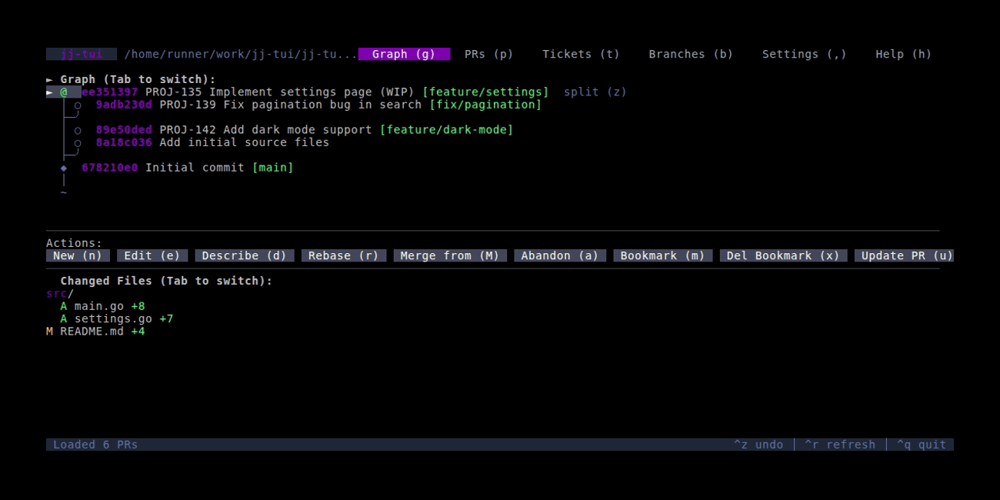
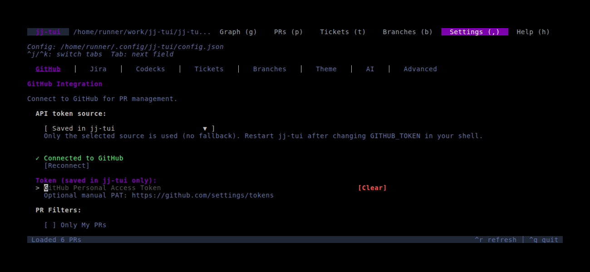
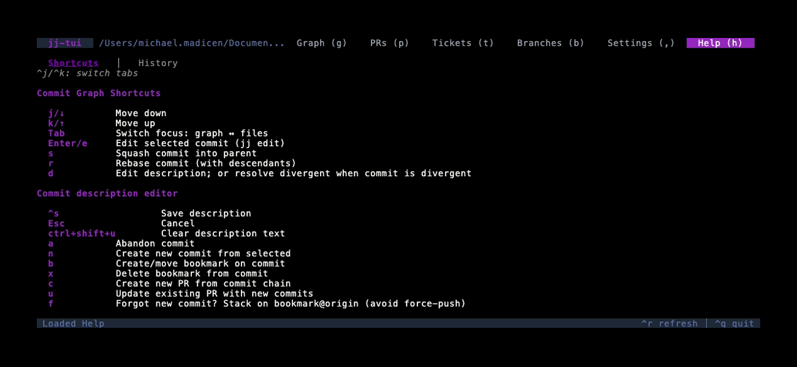
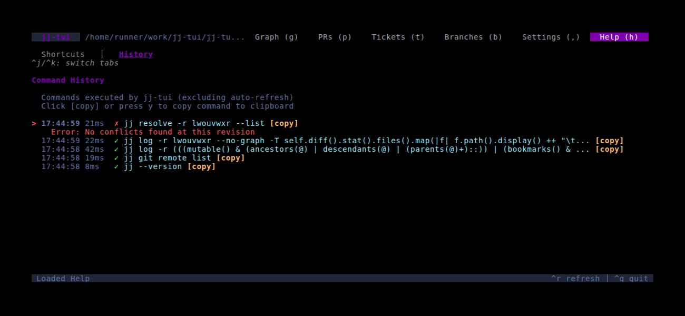
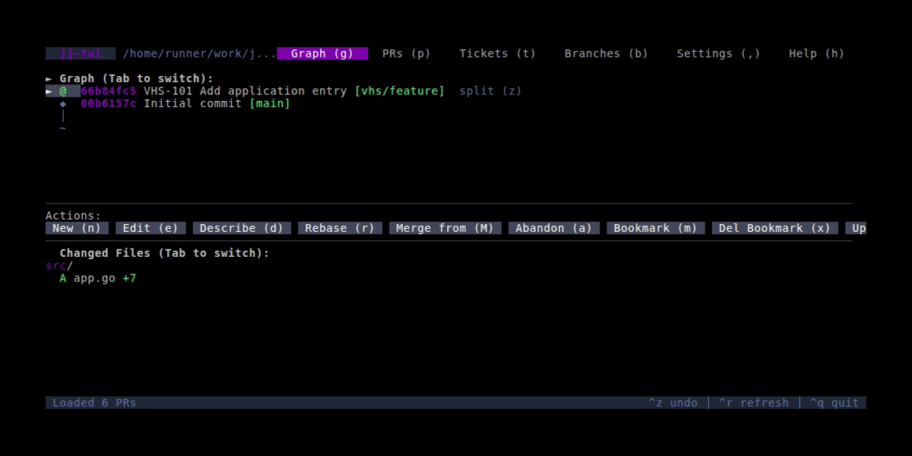
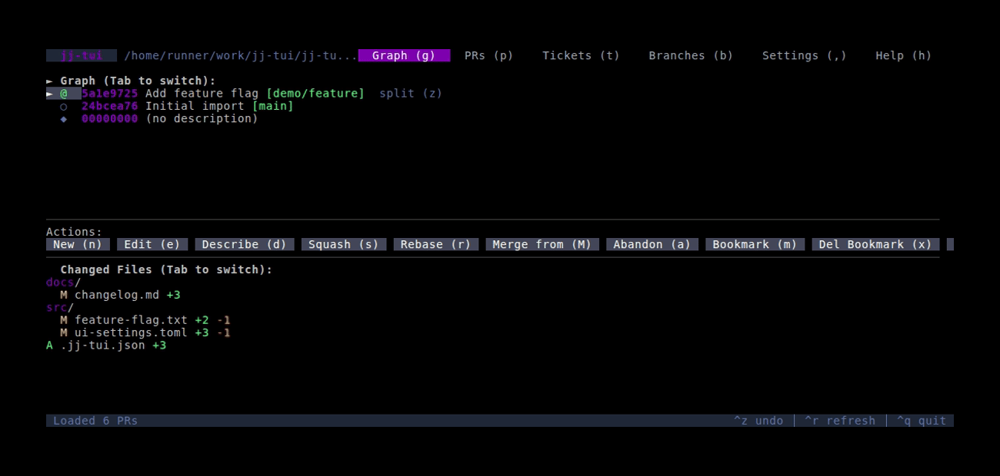
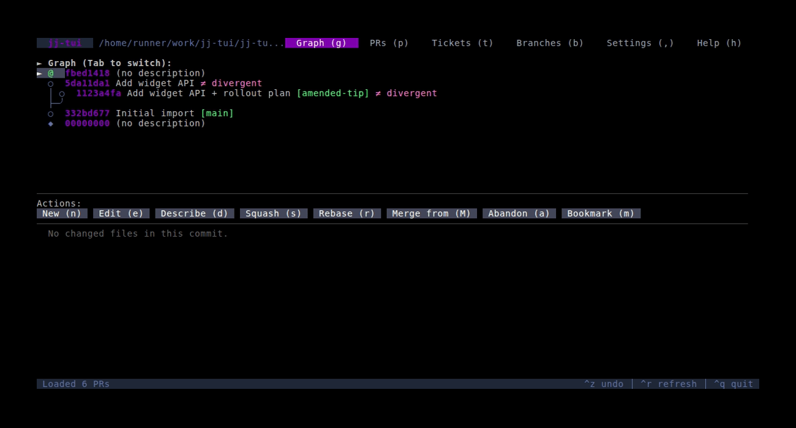
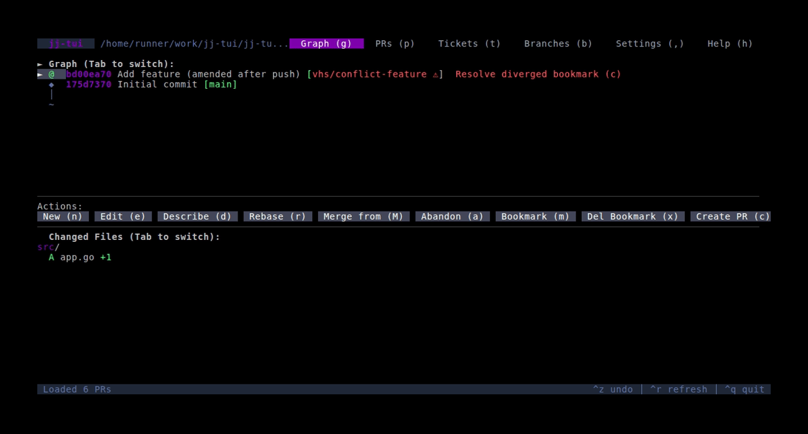

# Jujutsu TUI

[](https://github.com/madicen/jj-tui/actions/workflows/ci.yml)



A modern Terminal User Interface (TUI) for managing [Jujutsu (jj)](https://github.com/jj-vcs/jj) repositories. Built with [Bubble Tea](https://github.com/charmbracelet/bubbletea) and [Lip Gloss](https://github.com/charmbracelet/lipgloss) for an intuitive and beautiful command-line experience.

The demo above walks through the **commit graph**, **tickets**, **pull requests**, and **branches** (`make demo-gif` / `vhs/all.tape`). It does not open **Settings**; the static **Settings** capture below shows the full tab bar (including **AI** and **Advanced**). Other clips cover additional flows.

## Table of Contents

- [Screenshots](#screenshots)
- [Features](#features)
- [Prerequisites](#prerequisites)
- [Installation](#installation)
- [Quickstart](#quickstart)
- [Documentation](#documentation)
- [Contributing](#contributing)
- [License](#license)
- [Acknowledgments](#acknowledgments)

## Screenshots

### Settings


Sub-tabs run left to right: **GitHub**, **Jira**, **Codecks**, **Tickets**, **Branches**, **Theme**, **AI**, **Advanced**. Use **`Ctrl+j`** / **`Ctrl+k`** or click the tab bar to switch (see [Settings view](docs/USAGE.md#settings-view)).

### Help


### Command History


### Forgot new commit? and Update PR

If you already pushed a feature bookmark but kept editing on the same jj revision (so your tree diverges from `bookmark@origin`), **Forgot new commit?** (`f`) restacks that work on the remote tip so you can push without `--force`. **Update PR** (`u`) pushes the bookmark and updates the open PR. The clip below walks through opening a PR, editing without a new commit, then `f` and `u`.



### Split

**Split** (`z`) opens an **jj evolog** picker for the selected change: pick an older evolution revision as the parent, preview which files differ from the tip, then run the FAQ-style flow (`jj new`, `jj restore`, optional bookmark move, `jj abandon` old tip). Optional AI-assisted **file** split uses non-interactive `jj split -r @ -- <paths>`; use a recent **jj** (0.14+) so path arguments to `jj split` behave as expected. The recording below uses a small fixture repo (`fixtures/setup-evolog-split-vhs-repo.sh`) so the modal shows a clear two-file rollout delta.



### Resolving divergent commits

When the same **change ID** exists on more than one revision, the graph shows **divergent**. Press **`d`** on that row to open the resolver: each option lists metadata and a short **files vs parent** summary so you can pick which revision to keep (the others are abandoned). The clip uses `fixtures/setup-divergent-vhs-repo.sh`.



### Resolving diverged bookmarks (local vs remote)

When a bookmark was pushed and then amended or moved locally, **jj** may show the branch as diverged from `bookmark@origin`. **Branches** (`b`): move the highlight to the **diverged local** bookmark (`j`/`k`), then **Resolve Conflict** (`c`)—a **centered popup** compares local vs `origin` and offers **Keep local** (resolve the bookmark, then `jj git push`) or **Reset to origin**. The list is **sorted** (locals with commits ahead of `trunk` and none behind are listed before e.g. `main`), so in the bookmark-conflict fixture the diverged feature is often **already first**—an extra **Down** would select `main` and **`c`** would not open the resolver. On the **graph**, with the row selected and the graph pane focused, **`c`** opens the same resolver when that row has a diverged bookmark (otherwise **`c`** starts **Create PR**). **`C` (shift+c)** also opens the resolver on a diverged row. Narrow terminals stack the columns; wide terminals show local/remote and both choices **side by side** so the dialog stays short for mice. Recording: `fixtures/setup-bookmark-conflict-vhs-repo.sh`, `make bookmark-conflict-gif`.



## Features

- **Visual commit graph**: Navigate history with ASCII graph, symbols for working copy / mutable / immutable, divergent and conflict indicators
- **Split-pane layout**: Graph and changed files in separate scrollable panes; **Tab** or **click** to focus; mouse wheel scrolls the focused pane
- **Changed files**: Per-commit file list with line stats; **move** a file to a new parent/child commit (`[` / `]`) or **revert** it (`v`) from the files pane
- **File diff overlay**: **`o`** (files pane) opens a full **jj** diff for the selected path in a scrollable modal
- **External editor**: **`O`** (files pane) opens the selected file in Cursor, VS Code, Zed, Neovim (`nvr`), etc.—configured under **Settings → Advanced** (editor presets and custom command)
- **Rebase**: **`r`** enters destination-pick mode, or **drag** a commit row onto another (mouse) for the same `jj rebase -s … -d …` flow
- **Merge from**: **`M`** enters source-pick mode; select a bookmark/commit to merge into the selected commit (e.g. merge `main` into your current bookmark) via `jj new <target> <source>`
- **Keyboard & mouse**: Zone-based clicks across tabs, settings, PRs, tickets, and branch lists
- **GitHub**: Create/update PRs, device-flow login, PR list with CI and review hints
- **Tickets**: Jira, Codecks, or GitHub Issues—provider choice in Settings; create a bookmark from a ticket on your current commit; status transitions where supported
- **Branches**: List locals/remotes, track/untrack, push/fetch, resolve diverged bookmarks
- **Repository remote management**: Configure / change / remove the git `origin` from inside the TUI, push current or all bookmarks in one click, or run **`gh repo create` + auto-push** when bootstrapping a new GitHub repo (see [GitHub settings tab](docs/USAGE.md#github-settings-tab))
- **Settings**: GitHub (token, PR filters, **`origin` remote management**), Jira, Codecks, **Tickets** (provider + workflow), **Branches** (limit), **Theme** (colors), **AI** (LLM provider, keys, evolog split defaults), **Advanced** (external editor, graph revset, bookmark sanitize, destructive cleanup)
- **Help tab**: Shortcuts reference plus **command history** of **jj** commands the TUI ran (copy-friendly)
- **Evolog split (`z`)**: Experimental FAQ-style split when evolution history allows (see [Split](#split))
- **Divergent commits & diverged bookmarks**: Dedicated flows from the graph or Branches tab (see [screenshots](#screenshots) above)
- **Undo / redo**: **`Ctrl+z`** / **`Ctrl+y`** for **jj** undo and redo
- **Non-repo & init**: [Welcome screen](docs/USAGE.md#welcome-screen-non-jj-directories) with **`jj git init --colocate`**, optional **remote URL** to wire up `origin`, and a one-shot **`gh repo create`** path (when the GitHub CLI is installed)
- **Demo mode**: **`jj-tui --demo`** uses mock tickets/PRs for screenshots or trying the UI; **Settings** is available with the same sub-tabs (including **AI**), using mock or empty integration fields
- **Config**: Global and per-repo **`.jj-tui.json`** merge; optional **`JJ_TUI_CONFIG`**

## Prerequisites

- [Jujutsu (jj)](https://jj-vcs.github.io/jj/) installed and on your `PATH`
- A jj repository to work with (or use **`jj-tui --demo`**)

## Installation

### Homebrew (macOS/Linux)

```bash
brew install --cask madicen/tap/jj-tui
```

### Go Install

If you have Go 1.24+ installed:

```bash
go install github.com/madicen/jj-tui@latest
```

### Download Binary (Linux/macOS)

Download and install the latest release with one command:

**Linux (amd64):**
```bash
curl -sL $(curl -s https://api.github.com/repos/madicen/jj-tui/releases/latest | grep browser_download_url | grep linux_amd64 | cut -d '"' -f 4) | tar xz && sudo mv jj-tui /usr/local/bin/
```

**Linux (arm64):**
```bash
curl -sL $(curl -s https://api.github.com/repos/madicen/jj-tui/releases/latest | grep browser_download_url | grep linux_arm64 | cut -d '"' -f 4) | tar xz && sudo mv jj-tui /usr/local/bin/
```

**macOS (Apple Silicon):**
```bash
curl -sL $(curl -s https://api.github.com/repos/madicen/jj-tui/releases/latest | grep browser_download_url | grep darwin_arm64 | cut -d '"' -f 4) | tar xz && sudo mv jj-tui /usr/local/bin/
```

**macOS (Intel):**
```bash
curl -sL $(curl -s https://api.github.com/repos/madicen/jj-tui/releases/latest | grep browser_download_url | grep darwin_amd64 | cut -d '"' -f 4) | tar xz && sudo mv jj-tui /usr/local/bin/
```

Or download manually from the [GitHub Releases](https://github.com/madicen/jj-tui/releases) page.

Available for:
- **macOS** (Intel & Apple Silicon)
- **Linux** (amd64 & arm64)
- **Windows** (amd64 & arm64)

### From Source

Requires Go 1.24+:

```bash
git clone https://github.com/madicen/jj-tui.git
cd jj-tui
go build -o jj-tui .
```

## Quickstart

```bash
# From within a jujutsu repository
jj-tui

# Or specify a repository path
jj-tui /path/to/your/jj/repo

# Demo mode: use a demo repo with mock tickets/PRs (e.g. for screenshots or trying the UI)
cd path/to/jj/repo
jj-tui --demo
```

Once inside, press `h` or `?` for the in-app shortcut reference, and `,` to open
Settings. Full key-by-key and integration docs live in
[docs/USAGE.md](docs/USAGE.md).

## Documentation

- **[Usage Guide](docs/USAGE.md)** — per-tab keys, workflows, integrations (GitHub / Jira / Codecks / GitHub Issues), and full configuration reference.
- **[Development Guide](docs/DEVELOPMENT.md)** — project structure, building, screenshots (VHS + fixtures), and dependencies.
- **[Testing Guide](docs/TESTING.md)** — unit vs integration boundary, fixtures, mocks, and running against a real `jj`.

## Contributing

1. Fork the repository
2. Create a feature branch
3. Add tests for new functionality
4. Run integration tests
5. Submit a pull request

See [docs/DEVELOPMENT.md](docs/DEVELOPMENT.md) and [docs/TESTING.md](docs/TESTING.md) for setup and conventions.

## License

MIT License - see LICENSE file for details.

## Acknowledgments

- [Jujutsu (jj)](https://jj-vcs.github.io/jj/) for the amazing VCS
- [Charm](https://charm.sh/) for the excellent TUI libraries
- The Go community for great tooling and libraries
